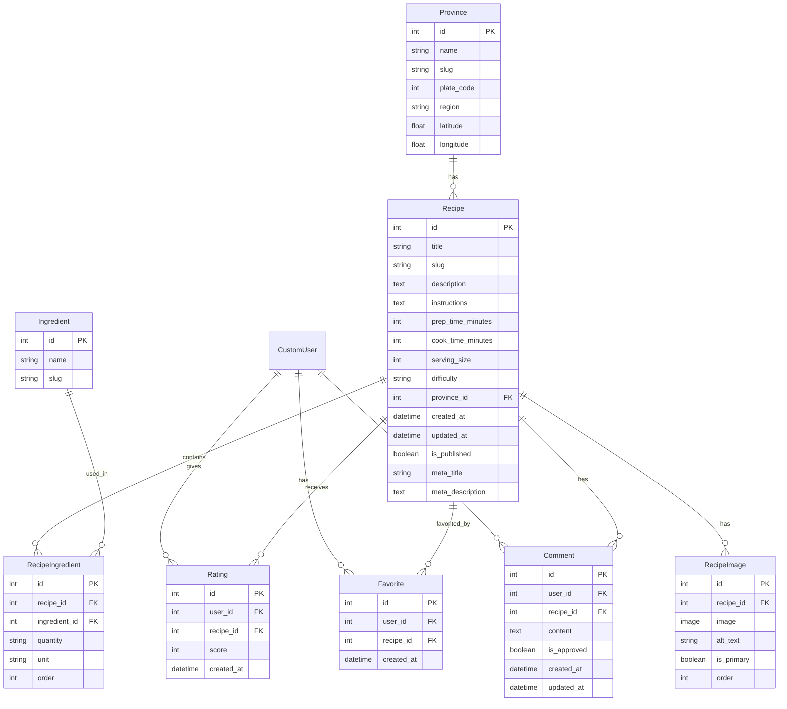

# Türkiye Yöresel Yemekleri — Proje Mimari Planı

## 1. Projenin Büyük Resmi

Türkiye'nin 81 ilinin yöresel yemeklerini tanıtan, interaktif harita üzerinden navigasyon sunan, kullanıcı üyelik ve yorum sistemiyle sosyal etkileşim sağlayan kapsamlı bir Django web uygulaması. İleride mobil uygulama desteği için API-ready mimari tasarlanacak.

---

## 2. Mimari Kararlar ve Gerekçeler

### 2.1 Uygulama Yapısı (Django Apps)

Projeyi **sorumluluk alanlarına (Separation of Concerns)** göre Django app'lerine böleceğiz:

```
FOOD/
├── core/                    # Proje ayarları (settings, urls, wsgi, asgi)
├── recipes/                 # Tarifler (ana iş mantığı)
├── accounts/                # Kullanıcı yönetimi (kayıt, giriş, profil)
├── provinces/               # İl verileri ve harita mantığı
├── interactions/             # Puanlama, favoriler, yorumlar
├── api/                     # REST API (mobil hazırlık) — Sprint 2+
├── templates/               # Global template'ler
│   ├── base.html
│   ├── includes/            # Navbar, footer, vb. parçalar
│   ├── recipes/
│   ├── accounts/
│   └── provinces/
├── static/                  # CSS, JS, görseller
│   ├── css/
│   ├── js/
│   ├── images/
│   │   └── map/             # Türkiye haritası SVG
│   └── fonts/
├── media/                   # Kullanıcı/admin yüklediği dosyalar
├── locale/                  # Çeviri dosyaları (gelecek)
├── requirements/
│   ├── base.txt
│   ├── dev.txt
│   └── prod.txt
├── .env                     # Hassas veriler (Git'e EKLENMEYecek)
├── .env.example             # Örnek env dosyası
├── .gitignore
├── Dockerfile
├── docker-compose.yml
├── nginx/
│   └── default.conf
└── manage.py
```

**Neden bu yapı?**

| Karar | Gerekçe |
|-------|---------|
| `recipes` ayrı app | Ana iş mantığı izole, bağımsız test edilebilir |
| `accounts` ayrı app | Django'nun auth sistemiyle entegre, Custom User Model |
| `provinces` ayrı app | İl verisi statik, tarif verisinden bağımsız |
| `interactions` ayrı app | Puanlama/yorum/favori mantığı farklı modellere bağımlı, tek app'te toplamak SRP'yi ihlal eder |
| `api` ayrı app | Mobil uygulama geldiğinde sadece bu app büyüyecek, template'lere dokunmayacak |
| `requirements` klasörü | Dev ve prod bağımlılıkları ayrıştırma |

### 2.2 Custom User Model — İlk Sprint'te Zorunlu

> [!CAUTION]
> **Django projesinin en kritik kararı budur.** Custom User Model proje başında tanımlanmazsa, ileride değiştirmek migration cehennemine yol açar. `AUTH_USER_MODEL` ayarını ilk migration'dan ÖNCE yapmalıyız.

```python
# accounts/models.py
class CustomUser(AbstractUser):
    # Şimdi ekstra alan eklemesek bile, ileride profil foto,
    # favori sayısı gibi alanlar eklemek sorunsuz olacak
    pass
```

### 2.3 Veritabanı Motoru

- **Geliştirme:** SQLite (hızlı başlangıç, sıfır kurulum)
- **Staging/Production:** PostgreSQL

> [!NOTE]
> Geliştirme aşamasında SQLite ile başlayacağız. PostgreSQL'e geçiş `settings.py`'de engine değişikliği ile yapılacak. Django ORM soyutlaması sayesinde model kodlarımız değişmeyecek. Docker aşamasında PostgreSQL container'ı ekleyeceğiz.

### 2.4 Mobil Uygulama Hazırlığı

Mobil hazırlık için **API-first değil, API-ready** yaklaşımı kullanacağız:

1. İş mantığını view'larda değil, **service layer** veya **model manager'larda** tutacağız
2. Template view'lar ve API view'lar aynı iş mantığını çağıracak
3. API app'i Sprint 2'de Django REST Framework ile eklenecek
4. Serializer'lar model'lerden otomatik üretilecek

```
┌──────────────────────────────────────────────┐
│                   Client                      │
│  ┌─────────────┐       ┌──────────────────┐  │
│  │  Web Browser │       │  Mobile App      │  │
│  │  (Template)  │       │  (React Native)  │  │
│  └──────┬───────┘       └────────┬─────────┘  │
│         │                        │             │
└─────────┼────────────────────────┼─────────────┘
          │                        │
  ┌───────▼────────┐      ┌───────▼────────┐
  │  Django Views   │      │  DRF API Views │
  │  (Template)     │      │  (JSON)        │
  └───────┬────────┘      └───────┬────────┘
          │                        │
          └──────────┬─────────────┘
                     │
          ┌──────────▼──────────┐
          │   Service / Manager  │
          │   (İş Mantığı)       │
          └──────────┬──────────┘
                     │
          ┌──────────▼──────────┐
          │   Django ORM         │
          │   (Models)           │
          └──────────┬──────────┘
                     │
          ┌──────────▼──────────┐
          │   PostgreSQL         │
          └─────────────────────┘
```

---

## 3. Veritabanı Tasarımı (ER Diyagramı)



### 3.1 Tasarım Kararları

| Tablo | Karar | Gerekçe |
|-------|-------|---------|
| `Ingredient` | Ayrı tablo | Malzemeler normalize edildi. Arama, filtreleme ve "bu malzeme ile yapılan yemekler" özelliği için gerekli |
| `RecipeIngredient` | Many-to-Many through tablosu | Miktar, birim, sıralama bilgisi taşıyor. Django'nun `ManyToManyField(through=...)` ile |
| `RecipeImage` | Ayrı tablo | Bir tarifin birden fazla görseli olabilir. `is_primary` ile ana görseli belirle |
| `Rating` | Ayrı tablo | `unique_together = (user, recipe)` ile kullanıcı başına tek puan. Ortalama `Avg()` ile hesaplanacak |
| `Comment.is_approved` | Boolean alan | Admin onayı için. Django Admin'de `list_filter` ile filtrelenecek |
| `Province` | `latitude`, `longitude` | Harita üzerinde tooltip/marker konumlandırma için |
| `Recipe` | `meta_title`, `meta_description` | SEO için her tarifin kendi meta verisi |
| `slug` alanları | Her yerde | SEO-friendly URL'ler: `/istanbul/iskender-kebab/` |

### 3.2 İndeks Stratejisi (Performans)

```python
# Sık sorgulanan alanlar için veritabanı indeksleri
class Recipe(models.Model):
    class Meta:
        indexes = [
            models.Index(fields=['province', 'is_published']),  # İl sayfası sorgusu
            models.Index(fields=['slug']),                       # URL lookup
            models.Index(fields=['-created_at']),                # Son eklenenler
        ]
```

---

## 4. Sprint Planı

### Sprint 0 — Proje Altyapısı ✨ (ŞİMDİ)
- [x] Django projesi oluşturuldu
- [ ] Custom User Model (`accounts` app)
- [ ] Settings modernizasyonu (`.env` desteği, güvenlik ayarları)
- [ ] Proje dizin yapısı (templates, static, media)
- [ ] `.gitignore` ve `.env.example`
- [ ] Requirements dosyaları

### Sprint 1 — Veritabanı ve İl Verileri
- [ ] `provinces` app — Model, 81 il verisi (fixture/migration)
- [ ] `recipes` app — Model, RecipeIngredient, RecipeImage
- [ ] `interactions` app — Rating, Favorite, Comment modelleri
- [ ] Django Admin konfigürasyonu (tüm modeller)
- [ ] Veri girişi için management command

### Sprint 2 — Ana Sayfa ve Harita
- [ ] Türkiye SVG haritası (interaktif, tıklanabilir)
- [ ] Ana sayfa template ve view
- [ ] İl detay sayfası (yemek listesi + popüler yemekler)
- [ ] SEO meta tag'leri

### Sprint 3 — Tarif Detay Sayfası
- [ ] Tarif detay view ve template
- [ ] Malzeme listesi, yapılış, süreler
- [ ] Puanlama sistemi (AJAX)
- [ ] Favorilere ekleme (AJAX)
- [ ] Responsive tasarım

### Sprint 4 — Kullanıcı Sistemi
- [ ] Kayıt, giriş, çıkış, şifre sıfırlama
- [ ] Profil sayfası (favoriler, yorumlar)
- [ ] Email doğrulama

### Sprint 5 — Yorum Sistemi
- [ ] Yorum formu ve submit
- [ ] Admin onay mekanizması
- [ ] Küfür/argo filtresi
- [ ] AJAX ile yorum yükleme

### Sprint 6 — API Katmanı (Mobil Hazırlık)
- [ ] Django REST Framework kurulumu
- [ ] Serializer'lar
- [ ] API endpoint'leri (provinces, recipes, auth)
- [ ] Token authentication

### Sprint 7 — Performans ve Güvenlik
- [ ] Caching stratejisi (Django cache framework)
- [ ] Query optimizasyonu (`select_related`, `prefetch_related`)
- [ ] Rate limiting
- [ ] Security headers
- [ ] OWASP kontrol listesi

### Sprint 8 — Docker ve Deployment
- [ ] Dockerfile
- [ ] docker-compose.yml (Django + PostgreSQL + Nginx + Gunicorn)
- [ ] Nginx konfigürasyonu
- [ ] Gunicorn ayarları
- [ ] SSL/TLS
- [ ] CI/CD pipeline

---

## 5. Güvenlik Planı

| Katman | Önlem | Uygulama |
|--------|-------|----------|
| Input | XSS koruması | Django'nun auto-escaping template sistemi |
| Input | CSRF koruması | `` + middleware |
| Input | SQL Injection | Django ORM (ham SQL yazmayacağız) |
| Auth | Brute Force | Rate limiting (`django-axes` veya custom) |
| Auth | Güçlü şifre | Django password validators (zaten mevcut) |
| Auth | Session güvenliği | `SESSION_COOKIE_HTTPONLY`, `SESSION_COOKIE_SECURE` |
| Data | Hassas veri | `.env` dosyası, Secret Key production'da değişecek |
| Server | HTTP Headers | `SecurityMiddleware`, `X-Content-Type-Options`, `HSTS` |
| Server | Clickjacking | `X-Frame-Options: DENY` (zaten mevcut) |
| Upload | Dosya validasyonu | Resim boyut/format kontrolü, `ImageField` |
| Comment | Küfür filtresi | Custom validator + admin onay |

---

## 6. SEO Stratejisi

| Unsur | Uygulama |
|-------|----------|
| Semantic URL'ler | `/istanbul/`, `/istanbul/iskender-kebab/` |
| Meta Tag'ler | Her sayfada dynamic `<title>`, `<meta description>` |
| Open Graph | Sosyal medya paylaşımı için OG tag'leri |
| Sitemap | `django.contrib.sitemaps` |
| robots.txt | Statik dosya olarak veya view |
| Structured Data | JSON-LD (Recipe schema — Google Rich Results) |
| Canonical URL | Duplicate content önleme |
| H1/H2 hiyerarşisi | Her sayfada tek H1, mantıklı heading yapısı |
| Lazy loading | Görseller için `loading="lazy"` |
| Alt text | Tüm görsellerde açıklayıcı alt text |

> [!IMPORTANT]
> **JSON-LD Recipe Schema**, Google'da tarif aramasında zengin snippet gösterimi sağlar (yıldız puanı, süre, kalori gibi bilgiler arama sonuçlarında görünür). Bu, organik trafik için çok değerli.

---

## 7. Performans Stratejisi

| Alan | Strateji |
|------|----------|
| Veritabanı | `select_related`, `prefetch_related` ile N+1 query engelleme |
| Veritabanı | Sık sorgulanacak alanlara index |
| Caching | İl sayfaları ve popüler tarifler için `cache_page` decorator |
| Caching | Rating ortalaması için computed/cached field |
| Template | Template fragment caching |
| Statik dosyalar | `ManifestStaticFilesStorage` ile cache busting |
| Görseller | WebP format desteği, thumbnail oluşturma |
| Frontend | CSS/JS minification (production) |
| Pagination | İl yemek listesinde sayfalama |

---

## 8. Kullanılacak Kütüphaneler

### Zorunlu (Sadece Gerçekten Lazım Olanlar)

| Kütüphane | Amaç | Gerekçe |
|-----------|------|---------|
| `Django` | Web framework | Temel |
| `Pillow` | Resim işleme | `ImageField` için zorunlu |
| `python-decouple` | `.env` okuma | Hassas verileri kod dışında tutmak için |
| `psycopg` | PostgreSQL driver | Production DB bağlantısı (psycopg3) |
| `gunicorn` | WSGI server | Production deployment |

### Opsiyonel (İhtiyaç Olduğunda Eklenecek)

| Kütüphane | Amaç | Ne Zaman |
|-----------|------|----------|
| `djangorestframework` | REST API | Sprint 6 — Mobil hazırlık |
| `django-axes` | Login brute force koruması | Sprint 7 |

> [!TIP]
> Kütüphane sayısını minimumda tutuyoruz. Django'nun built-in özellikleri çoğu ihtiyacı karşılıyor. Gereksiz dependency = gereksiz güvenlik yüzeyi.

---

## 9. User Review Required

> [!IMPORTANT]
> ### Kararlarınızı Bekliyorum:
>
> 1. **Geliştirme veritabanı:** SQLite ile başlayıp Docker aşamasında PostgreSQL'e geçiş uygun mu? Yoksa baştan PostgreSQL mi kurulsun?
>
> 2. **Harita yaklaşımı:** Türkiye SVG haritasını interaktif olarak kodlayacağız. Her il tıklanabilir polygon olacak. Bu yaklaşım uygun mu?
>
> 3. **Dil:** Siteyi şimdilik sadece Türkçe mi yapacağız? İleride çoklu dil desteği (i18n) düşünüyor musun?
>
> 4. **Sprint 0'dan başlayalım mı?** Plan onaylandığında Custom User Model + Settings modernizasyonu + Proje yapısı ile başlayacağız.

---

## 10. Verification Plan

### Automated Tests
- Her sprint'te `pytest` veya Django'nun `TestCase` ile birim testler
- `python manage.py check --deploy` ile deployment kontrol listesi
- `python manage.py test` ile tüm testlerin geçtiğini doğrulama

### Manual Verification
- Her sprint sonunda browser'da manuel test
- Admin panel üzerinden veri girişi ve yönetim testi
- Responsive tasarım kontrolü (mobil, tablet, masaüstü)
- Lighthouse ile performans ve SEO skoru ölçümü
