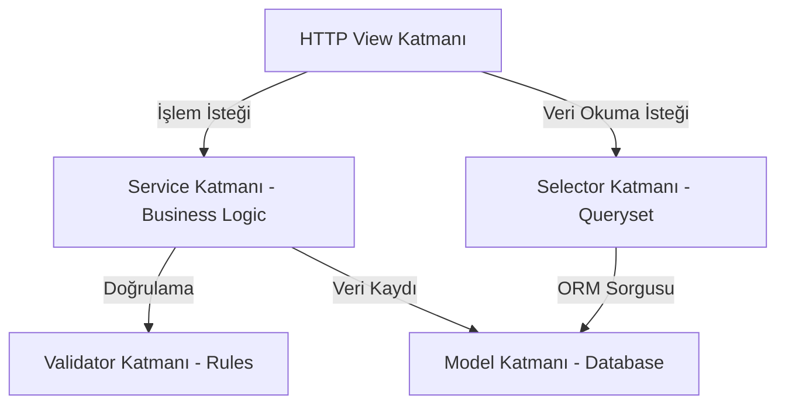

# 🏛️ Clean Architecture ve Katman Kuralları

FOOD projesi, iş mantığının sunum ve veritabanı katmanlarından tamamen ayrıldığı **Clean Architecture** prensiplerine tabidir.

---

## 📐 Katman Sorumluluk Matrisi

| Katman | Sorumluluk | İzin Verilen İşlemler | Kesinlikle Yasak Olanlar |
| :--- | :--- | :--- | :--- |
| **View** | HTTP Request/Response yönetimi | Service/Selector çağırma, şablon render etme | Business logic yazmak, sorgu atmak, validation yapmak |
| **Service** | İş Mantığı (Business Logic) | Veri güncelleme/kaydetme, transaction yönetimi | HTTP nesneleri (request) kullanmak, HTML render etmek |
| **Selector** | Veri Okuma (Queries) | `select_related`, `prefetch_related`, filtreleme | Veri yazmak/güncellemek, side-effect oluşturmak |
| **Validator** | Veri ve Girdi Doğrulama | Kuralları denetleme, `ValidationError` fırlatma | Veri kaydetmek, view mantığı çalıştırmak |
| **Model** | Veri Tanımı ve İlişkiler | Alan tanımları, `__str__`, kısıtlar (`Constraints`) | Karmaşık iş mantığı yazmak, dış API çağırmak |

---

## 🛠️ Katman Standartları

### 1. Service Katmanı (`services/`)
- Tüm veri değiştirme (create, update, delete) ve iş süreçleri burada yer alır.
- Birden fazla modeli etkileyen adımlar `@transaction.atomic` dekoratörü ile korunur.
- Örnek: `recipe_service.create_recipe(...)`

### 2. Selector Katmanı (`selectors/`)
- Veritabanından okuma yapan tüm karmaşık ORM sorguları buradadır.
- N+1 sorgu problemlerini engellemek için `select_related()` ve `prefetch_related()` kullanımı zorunludur.
- Örnek: `province_selector.get_active_provinces_with_recipe_count()`

### 3. Validator Katmanı (`validators/`)
- Veri formatı, boyutları, iş kısıtları doğrulama işlevi görür.
- Hata durumunda spesifik `ValidationError` fırlatır.
- Örnek: `image_validator.validate_recipe_image(file)`

### 4. Model Katmanı (`models/`)
- Sadece veri yapılarını ve veritabanı constraint'lerini tanımlar.
- Model metotları sadece kendi alanlarını temsil eder (`get_absolute_url` vb.).

---

## 🚫 Tavizsiz Kurallar
1. **View İçinde İş Mantığı Yasaktır:** Views sadece Request alır, Service/Selector çağırır, Response döner.
2. **Model İçinde İş Mantığı Yasaktır:** Model sınıflarına ağır business logic eklenmez.
3. **Template/JS İçinde İş Mantığı Yasaktır:** Şablon ve istemci tarafı sadece sunum yapar.

---

## 🔗 İlgili Bağlantılar
- [[Kodlama Standartları]] — İsimlendirme ve PEP8 kuralları
- [[Veritabanı Mimarisi]] — Veri modeli kuralları
- [[Güvenlik Rehberi]] — Doğrulama ve güvenlik standartları
