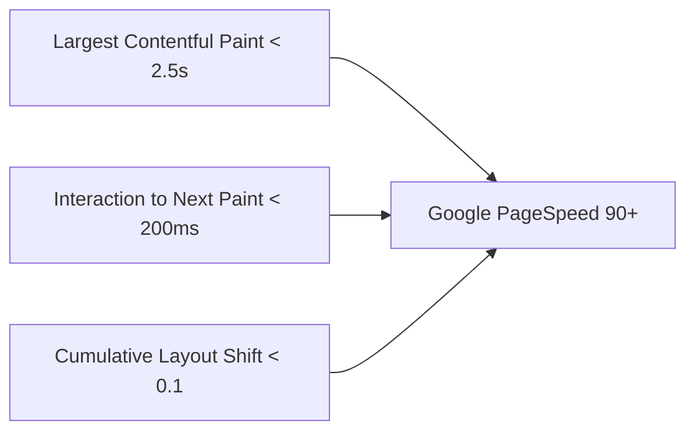

# 🚀 SEO ve Performans Standartları

FOOD projesi, Türkiye'nin en yüksek arama motoru görünürlüğüne ve Core Web Vitals performansına sahip yöresel yemek sitesi olma hedefiyle tasarlanmıştır.

---

## 🔍 SEO Mimarisi ve Bilesenleri

### 1. Dinamik URL ve Slug Politikası
- Tüm URL'ler küçük harf, Türkçe karakter dönüştürülmüş ve anlamlı kelimelerden oluşur.
- Örnek: `/il/gaziantep/`, `/tarif/ali-nazik/`, `/kategori/corbalar/`.
- Slug'lar bir kez oluşturulduktan sonra değiştirilmez (değişirse 301 Redirect uygulanır).

### 2. Meta Etiketler ve Sosyal Medya (OpenGraph)
Her sayfada benzersiz aşağıdaki meta etiketler yer alır:
- `<title>` (50-60 karakter)
- `<meta name="description">` (140-160 karakter)
- `<link rel="canonical">`
- OpenGraph (`og:title`, `og:description`, `og:image`, `og:url`)
- Twitter Card (`summary_large_image`)

### 3. Yapısal Veri (Schema.org / JSON-LD)
Tarif sayfalarında arama motorları için zengin sonuç (Rich Snippet) sağlayan `Recipe` Schema'sı dinamik üretilir:
- `name`, `description`, `image`
- `prepTime`, `cookTime`, `totalTime`
- `recipeYield`, `recipeIngredient`, `recipeInstructions`
- `aggregateRating` (puan ortalaması ve oy sayısı)

---

## ⚡ Core Web Vitals ve Performans Hedefleri

### Veritabanı Sorgu Optimizasyonu
- **N+1 Sorgu Yasaktır:** `Selector` katmanında ilişki çekerken `select_related()` (OneToOne/ForeignKey) ve `prefetch_related()` (ManyToMany) kullanımı zorunludur.
- **Sadece Gerekli Alanlar:** Sadece ihtiyaç duyulan kolonları çekmek için `only()` ve `defer()` kullanılır.
- **Paginate Edilmiş Listeler:** Listeleme sayfalarında kesinlikle pagination uygulanır.

### Görsel Optimizasyonu
- Tüm görseller WebP formatına dönüştürülür veya sıkıştırılır.
- İstemci tarafında `loading="lazy"` özniteliği kullanılır.
- Her görselde anlamlı `alt="..."` metni bulunması zorunludur.

---

## 🔗 İlgili Bağlantılar
- [[Recipes Modülü]] — Tarif detaylarının SEO yapısı
- [[Clean Architecture]] — Selector optimizasyonları
- [[Veritabanı Mimarisi]] — İndeksleme stratejisi
