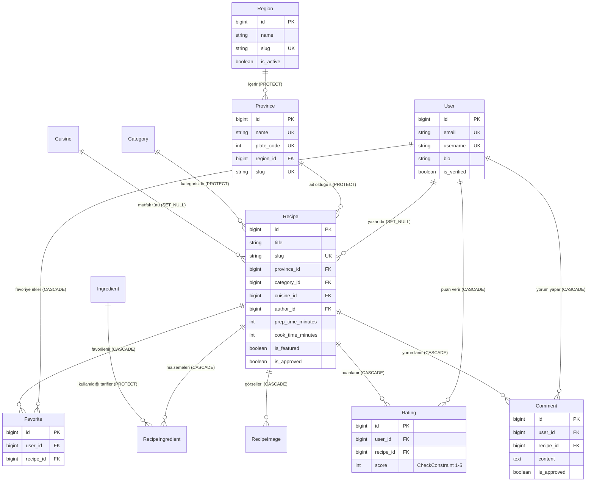

# 📊 Veri Modelleri ve ERD Şeması

Aşağıdaki Mermaid ERD diyagramı, FOOD platformundaki temel modelleri ve aralarındaki veritabanı ilişkilerini göstermektedir.

---

## 📐 ERD Diyagramı (Entity Relationship Diagram)

---

## 🔗 Modül Detayları
- [[Accounts Modülü]] — `User` tablosu detayları
- [[Provinces Modülü]] — `Region` ve `Province` tabloları
- [[Recipes Modülü]] — `Recipe`, `Category`, `Ingredient`, `RecipeImage` tabloları
- [[Interactions Modülü]] — `Rating`, `Favorite`, `Comment` tabloları
