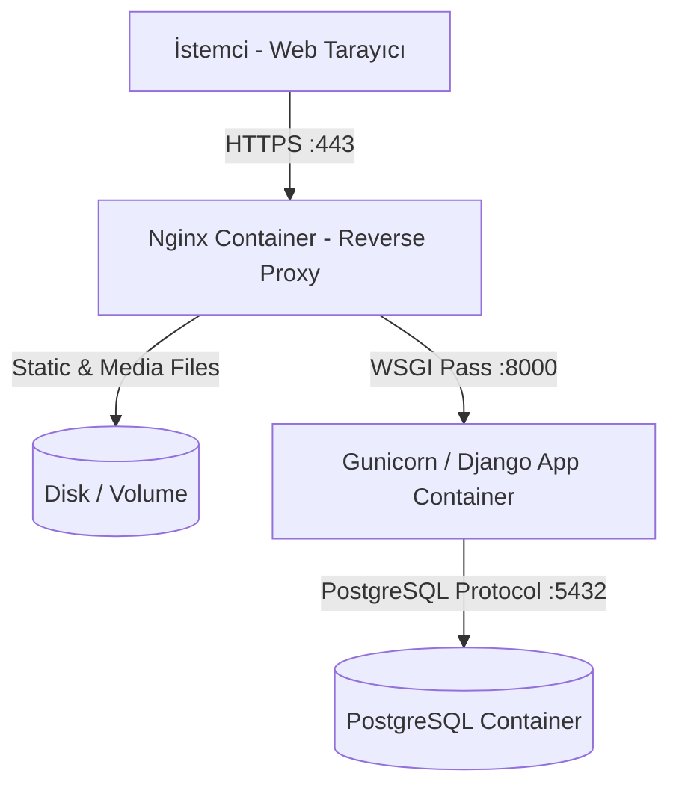

# 🐳 Docker ve Nginx Konfigürasyonu

FOOD projesi, ortam bağımsızlığını sağlamak ve kolay ölçeklenebilmek amacıyla tüm servisleri Docker container'ları halinde çalıştırır.

---

## 🏗️ Container Mimarisi

### Servis Tanımları (`docker-compose.yml`)

1. **`web` (Django + Gunicorn):**
   - Python 3.14 tabanlı imaj.
   - Gunicorn WSGI sunucusu ile 8000 portunda dinler.
   - Komut: `gunicorn config.wsgi:application --bind 0.0.0.0:8000`

2. **`postgres` (PostgreSQL 16):**
   - Resmi PostgreSQL 16 Alpine imajı.
   - Veri kalıcılığı için Docker named volume (`postgres_data`) kullanılır.

3. **`nginx` (Web Sunucusu & Reverse Proxy):**
   - Static ve Media dosyalarını doğrudan istemciye sunar.
   - Gzip sıkıştırmasını yönetir.
   - SSL / HTTPS terminasyonunu sağlar.

---

## ⚙️ Nginx Ayar Kuralları
- **Static Dosyalar:** Nginx `/static/` isteklerini `STATIC_ROOT` dizininden doğrudan karşılar. Django static dosya sunmaz.
- **Media Dosyaları:** Nginx `/media/` isteklerini `MEDIA_ROOT` dizininden karşılar.
- **Reverse Proxy:** Uygulama istekleri `proxy_pass http://web:8000` ile Gunicorn'a aktarılır.
- **Security Headers:** [[Güvenlik Rehberi#Güvenlik Başlıkları (Security Headers)|Güvenlik Başlıkları]] Nginx seviyesinde de desteklenir.

---

## 🔗 İlgili Bağlantılar
- [[Production Kontrol]] — Canlıya alma öncesi checklist
- [[Güvenlik Rehberi]] — SSL ve HSTS yapılandırması
