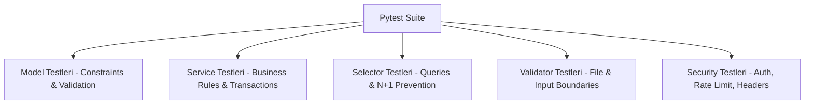

# 🧪 Test Stratejisi ve Kalite Kontrol

FOOD projesinde hiçbir yeni özellik, otomatik birim ve entegrasyon testleri yazılmadan ve geçmeden "tamamlandı" kabul edilmez.

---

## 🛠️ Test Altyapısı ve Kurulum

- **Test Runner:** `pytest` & `pytest-django`
- **Test Ayarları:** `config.settings.test`
- **Test Veritabanı:** PostgreSQL (`docker-compose.test.yml`)
- **Lint & Static Analysis:** `ruff` & `mypy`

---

## 📋 Katman Bazlı Test Sorumlulukları



### 1. Service Testleri (`tests/test_services.py`)
- İş kurallarının doğru çalışıp çalışmadığını, sınır değerlerde hata fırlatıp fırlatmadığını doğrular.
- Örnek: `test_rating_score_out_of_bounds_raises_validation_error`.

### 2. Selector Testleri (`tests/test_selectors.py`)
- ORM sorgularının doğruluğunu ve istenen verileri getirdiğini doğrular.
- `django_assert_num_queries` kullanarak N+1 sorgu olmadığını denetler.

### 3. Validator & Security Testleri
- Zararlı dosya yüklemeleri (`test_invalid_image_magic_bytes_rejected`).
- Rate limiting middleware engellemeleri (`test_rate_limit_exceeded_returns_429`).
- Yetkisiz erişim denemeleri (`test_anonymous_user_cannot_create_recipe`).

---

## 🚀 Testleri Çalıştırma Komutları

```powershell
# PostgreSQL Docker container üzerinde tüm testleri çalıştır:
docker-compose -f docker-compose.test.yml run --rm test pytest

# Sadece belirli bir uygulamanın testlerini çalıştır:
pytest recipes/tests/

# Coverage (Kapsam) raporu al:
pytest --cov=. --cov-report=html
```

---

## 🔗 İlgili Bağlantılar
- [[Clean Architecture]] — Test edilen katmanlar
- [[Güvenlik Rehberi]] — Güvenlik regresyon testleri
- [[Yol Haritası (Roadmap)]] — Faz 1 Test doğrulamaları
